# 计算机网络实验报告

- 姓名: 蔡宇翔 
- 时间: 2020-12-28
- 学号：18020023001
- 专业：计算机科学与技术
- 年级：18

## 实验综述

本实验基于 Java 6 平台，实现 TCP 协议端到端的可靠传输数据包传送和确认，及对各种传输错误的处理。

实验框架如下:

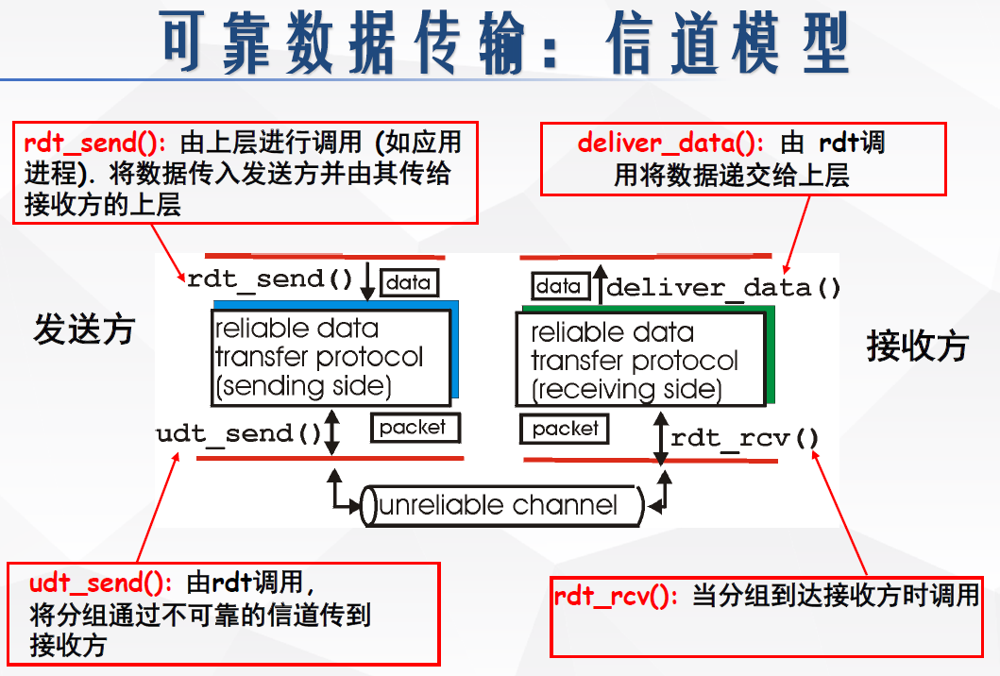

实验流程：RDT1.0(在可靠信道上进行可靠的数据传输) -> RDT2.0(信道上可能出现位错) -> RDT2.1(管理出错的 ACK/NACK) -> RDT2.2(仅使用 ACK) -> RDT3.0(信道上可能出错和丢失数据) -> RDT4.0(流水线协议) -> RDT5.0(拥塞控制)

我实现的 RDT4.0 为 Go-Back-N 协议，RDT5.0 实现至 Reno 版本

## TCP: Go-Back-N

### 原理

在 RDT3.0 版本下，仍使用停止等待协议，即必须要收到一个包的 ACK 才会去发下一个包，不然就阻塞应用层的调用。在实际环境下，这非常影响效率，每一次任何包的任何错误如丢包，位错都会导致计时器超时重发，使得信道利用率很低，大部分时间都在等待计时器超时。这时我们引入流水线协议：发送端允许发送出多个包，他们"悬在空中"，等待应答。这带来一个最大的问题：现在无论是发送方，还是收包方，包到达的时间不再是按顺序的。 Go-Back-N 提出了一种方式：

- 发送者在流水线队列维持 N 个没有确认的发送包，用计时器跟踪最久未确认的发送包，计时器到时，重传所有未确认的包。
- 接收方仅发送累积确认，即发送的确认号为当前按序包的最大号，对失序的包不确认（可以选择缓存也可以直接丢弃，这里我实现的是丢弃）。

实现这种方式需要用到窗口


- send_base: 窗口内第一个没有被 ACK 的包，也是窗口左沿
- nextseqnum: 下一个可以发送的包
- window size: 窗口大小

对于发送方：
- 当收到一个 ACK 包时，send_base 加 1，窗口向右滑动 1 位。
- 当要发送一个新的包时，先判断 nextseqnum 在不在窗口内，是就发新包然后 nextseqnum 加 1。反之阻塞不允许发送等待收到 ACK
- 维护一个计时器，当发生超时时将窗口内的包全部重发。

对于接受方：
- 维护一个期待收到的包的序号，为当前收到包的按序最大号的下一个。
- 收到一个不是期待的序号的包，丢弃。是期待的序号就发一个 ACK 包回去，自身期待的包的序号加一。


### 状态转移图

- 发送方

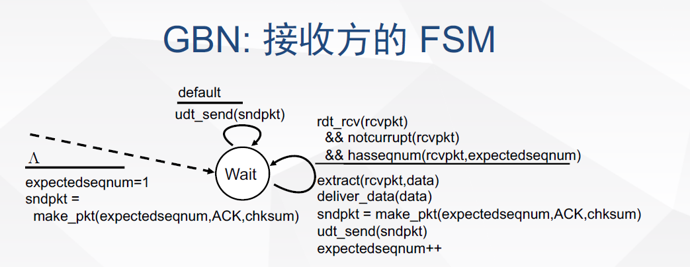

- 接收方

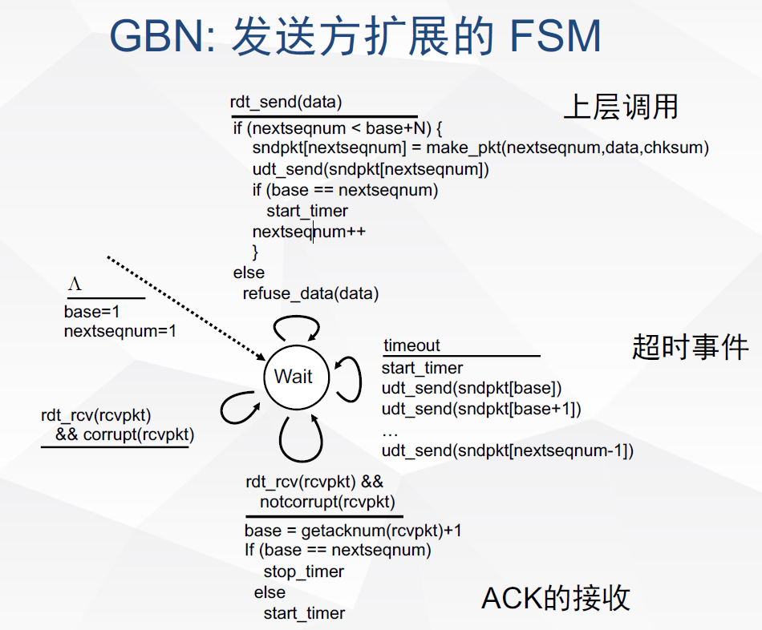

### 代码实现

**实验框架基于 Java 包 TCP_Win_TestSys.jar**

#### 校验

- 使用 CRC 校验

```java
public class CheckSum {
	// 计算 TCP 校验核
	public static short computeChkSum(TCP_PACKET tcpPack) {
		int checkSum = 0;
		TCP_HEADER h = tcpPack.getTcpH();

		CRC32 crc = new CRC32();
		crc.reset();
		crc.update(tcpPack.getSourceAddr().getAddress());
		crc.update(tcpPack.getDestinAddr().getAddress());
		crc.update(0);
		crc.update(6);
		crc.update(h.getTh_Length());
		crc.update(h.getTh_sport());
		crc.update(h.getTh_dport());
		crc.update(h.getTh_seq());
		crc.update(h.getTh_ack());
		crc.update(h.getTh_doff());

		crc.update(h.getTh_win());
		crc.update(h.getTh_urp());
		crc.update(h.getTh_mss());

		for (int i = 0; i < tcpPack.getTcpS().getData().length; i++) {
			crc.update(tcpPack.getTcpS().getData()[i]);
		}
		checkSum = (int)crc.getValue();
		return (short) checkSum;
	}
```

#### 发送方

```java
package com.ouc.tcp.test;

import com.ouc.tcp.client.TCP_Sender_ADT;
import com.ouc.tcp.client.UDT_Timer;
import com.ouc.tcp.message.*;

import java.util.concurrent.LinkedBlockingQueue;

enum FlagType {
	Stable,            //信道无差错
	ErrorOnly,         //只出错
	LossOnly,          //只丢包
	DelayOnly,         //只延迟
	ErrorWithLoss,     //出错 / 丢包
	ErrorWithDelay,    //出错 / 延迟
	LossWithDelay,     //丢包 / 延迟
	RealEnv,           //实际环境=出错 / 丢包 / 延迟
}

public class TCP_Sender extends TCP_Sender_ADT {
	
	private TCP_PACKET tcpPack;	//待发送的TCP数据报
	private volatile int flag = 0;
	private TCP_PACKET rcvPack;  // 已经收到的recv_pkt
	private UDT_Timer timer;
	private LinkedBlockingQueue<TCP_PACKET> packets;
	private short windows = 16;
	private int send_base = 1;
	private int next_seq = 1;
	private TaskPacketsRetransmit task;

	public TCP_Sender() {
		super();
		super.initTCP_Sender(this);	
		timer = new UDT_Timer();
		packets = new LinkedBlockingQueue<TCP_PACKET>();
	}
	
	@Override
	public void rdt_send(int dataIndex, int[] appData) {
		while (next_seq >= send_base + windows){
		}
		tcpH.setTh_seq(next_seq);
		tcpS.setData(appData);
		tcpPack = new TCP_PACKET(tcpH, tcpS, destinAddr);

		tcpH.setTh_sum(CheckSum.computeChkSum(tcpPack));
		tcpPack.setTcpH(tcpH);
		udt_send(tcpPack);
		try {
			if(this.append(tcpPack)){
			}
			else {
				System.out.println("queue is full, this shouldn't has appeared!");
			}
		} catch (CloneNotSupportedException ignored) {
		}

		if (send_base == next_seq){
			task = new TaskPacketsRetransmit(client, packets);
			timer.schedule(task, 3000, 3000);

		}
		next_seq += 1;
	}
	
	@Override
	public void udt_send(TCP_PACKET stcpPack) {
		tcpH.setTh_eflag((byte) FlagType.RealEnv.ordinal());		
		client.send(stcpPack);
	}	
	@Override
	public void waitACK() {

		int ack = this.rcvPack.getTcpH().getTh_ack();
		if (ack >= send_base){
			int d = (ack + 1) - send_base;
			send_base = ack + 1;
			this.slide(d);
			if (send_base == next_seq){
				task.cancel();
			}
			else {
				task.cancel();
				task = new TaskPacketsRetransmit(client, packets);
				timer.schedule(this.task, 3000, 3000);

			}
			System.out.println("Clear: "+ack);
			ackQueue.add(rcvPack.getTcpH().getTh_ack());
		}
		else{
			System.out.println("An outdated ack");
		}
	}
	@Override
	public void recv(TCP_PACKET recvPack) {
		System.out.println("Receive ACK Number： "+ recvPack.getTcpH().getTh_ack());
		if(CheckSum.computeChkSum(recvPack) == recvPack.getTcpH().getTh_sum()) {
			this.rcvPack = recvPack;
			waitACK();
		}
		else {
			System.out.println("Wrong ack pkt, waiting for timeout");

		}
		System.out.println();
	}
	private boolean append(TCP_PACKET pkt) throws CloneNotSupportedException {
		if (this.packets.size() < this.windows){
			this.packets.offer(pkt.clone());
			return true;
		}
		else{
			return false;
		}
	}	
	private void slide(int s){
		for (int i = 0; i < s; i++) {
			this.packets.poll();
		}
	}
}

```

#### 重发任务

```java
package com.ouc.tcp.test;

import com.ouc.tcp.client.Client;
import com.ouc.tcp.message.TCP_PACKET;

import java.util.LinkedList;
import java.util.Queue;
import java.util.TimerTask;

public class TaskPacketsRetransmit extends TimerTask {

    private Client senderClient;
    private Queue<TCP_PACKET> packets;
    private TCP_PACKET pack;

    public TaskPacketsRetransmit(Client client, Queue<TCP_PACKET>pkt){
        super();
        senderClient = client;
        packets = pkt;
    }
    @Override
    public void run() {
        for (TCP_PACKET pkt: packets) {
            this.senderClient.send(pkt);
            pack = pkt;
        }
        System.out.println();
        System.out.println("Task timeout!!");
        System.out.println("resend the pkt start with:"
                + packets.element().getTcpH().getTh_seq()
                + " end with:"
                + pack.getTcpH().getTh_seq());
    }
}
```

#### 接收方

```java
package com.ouc.tcp.test;

import java.io.BufferedWriter;
import java.io.File;
import java.io.FileWriter;
import java.io.IOException;

import com.ouc.tcp.client.TCP_Receiver_ADT;
import com.ouc.tcp.message.*;
import com.ouc.tcp.tool.TCP_TOOL;
import com.ouc.tcp.test.FlagType;

public class TCP_Receiver extends TCP_Receiver_ADT {
	
	private TCP_PACKET ackPack;
	int expect_seq = 1;
		
	public TCP_Receiver() {
		super();
		super.initTCP_Receiver(this);
	}

	@Override
	public void rdt_recv(TCP_PACKET recvPack) {
		if(CheckSum.computeChkSum(recvPack) == recvPack.getTcpH().getTh_sum()) {
			if (expect_seq == recvPack.getTcpH().getTh_seq()){
				tcpH.setTh_ack(recvPack.getTcpH().getTh_seq());
				ackPack = new TCP_PACKET(tcpH, tcpS, recvPack.getSourceAddr());
				tcpH.setTh_sum(CheckSum.computeChkSum(ackPack));
				reply(ackPack);
				dataQueue.add(recvPack.getTcpS().getData());
				expect_seq += 1;

			}
			else {
				System.out.println("Discard pkt" + recvPack.getTcpH().getTh_seq());
				tcpH.setTh_ack(expect_seq-1);
				ackPack = new TCP_PACKET(tcpH, tcpS, recvPack.getSourceAddr());
				tcpH.setTh_sum(CheckSum.computeChkSum(ackPack));
				reply(ackPack);
			}

		}else{
			System.out.println("Recieve Computed: "+CheckSum.computeChkSum(recvPack));
			System.out.println("Recieved Packet"+recvPack.getTcpH().getTh_sum());
			System.out.println("Problem: Packet Number: "+recvPack.getTcpH().getTh_seq());
		}
		System.out.println();		
		if(dataQueue.size() == 20) 
			deliver_data();	
	}

	@Override
	public void deliver_data() {
		File fw = new File("recvData.txt");
		BufferedWriter writer;
		try {
			writer = new BufferedWriter(new FileWriter(fw, true));
			while(!dataQueue.isEmpty()) {
				int[] data = dataQueue.poll();
				for(int i = 0; i < data.length; i++) {
					writer.write(data[i] + "\n");
				}
				writer.flush();
			}
			writer.close();
		} catch (IOException e) {
			e.printStackTrace();
		}
	}

	@Override
	public void reply(TCP_PACKET replyPack) {
		tcpH.setTh_eflag((byte)FlagType.RealEnv.ordinal());
		client.send(replyPack);
	}
}
```

### 实验结果

全部的发送包的数据被记录在 Log.txt 下，应用层接收到的 data 被记录在 recvData.txt 中。

首先检查有没有有序的将收到的数据交付给应用层：

</div>

从部分截图可以看出正确的交付给了应用层。

继续观察 Log.txt

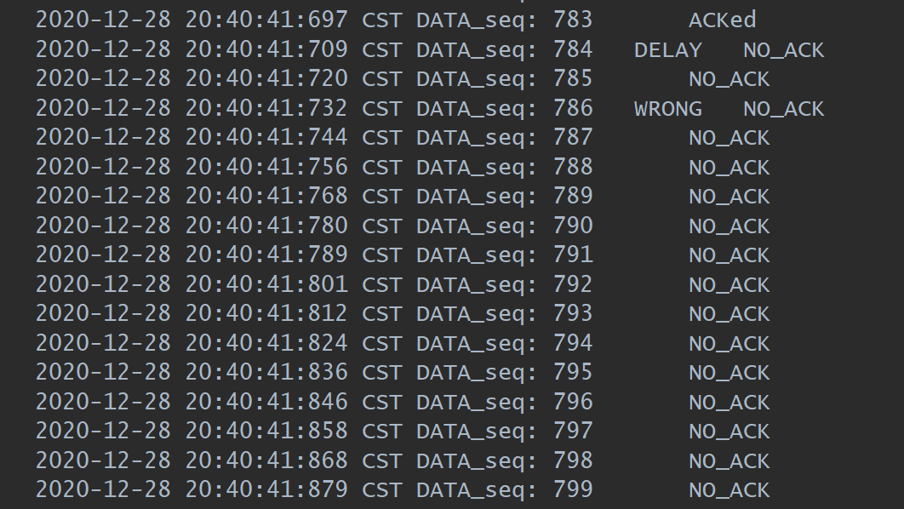

在 20:40:41 的时候序号为 784 的包发送发生了延时，我设置的窗口大小为 16，这时由于接收方在不停的发送对序号为 783 包的确认（如下图），导致后面的包都没有被确认。

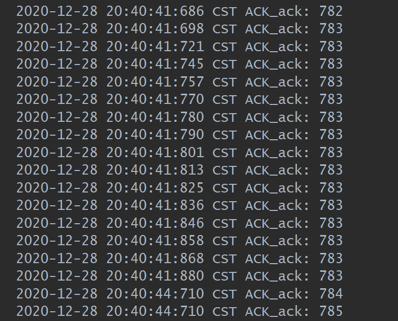

如图，接收方发送了16个对 783 号包的确认。

到了 20:40:44 的时候，计时器超时发生重发，序号为前面窗口内的全部包。

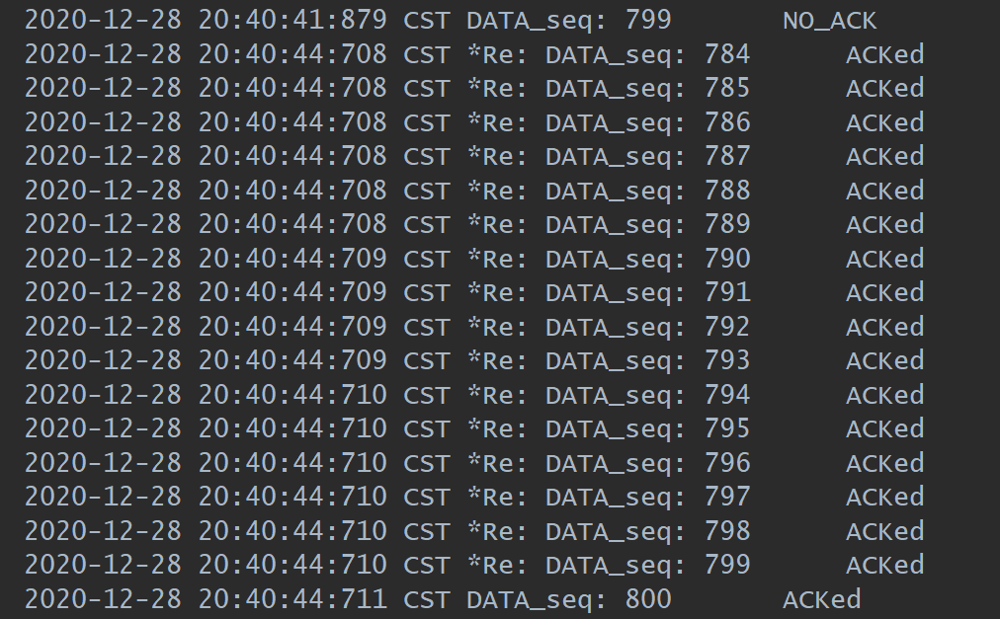

这次全部都收到了。

这些包在最后被接收方收到了。

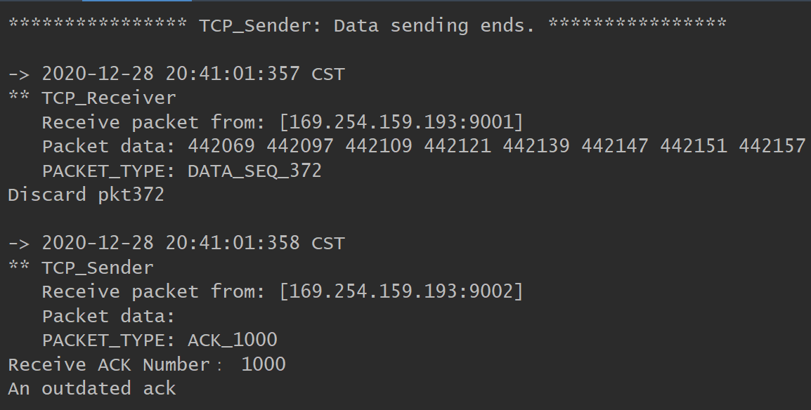

在控制台的输出中，被延时的包最终被接收方收到，但此时接收方期望的是 1001 号包，所以被丢弃了，同时向发送方发送了当前有序的最大的包序号 1000，这同样对于接收方来说是一个在窗口外的 ack，由接收方判断然后打印了"An outdated ack!"

## TCP: Reno

### 原理

Go-Back-N 和 Select Response 虽然解决了发送吞吐量低的问题，但不够好，它并没有考虑到实际情况中网络拥塞带来的影响。

若网络中某一资源的需求超过了该资源所能提供的可用部分，网络性能就会变坏，这种时候就是拥塞（congestion）。拥塞发生时，路由器会丢包，这时如果我们还是不停的重传没有收到 ACK 的包，也很大概率得不到 ACK，反而会恶化网络，这时就需要一种检测拥塞和当拥塞发生时控制的方法。

TCP 进行拥塞控制的方法有四种:即慢开始，拥塞避免，快重传，快恢复。

慢开始算法的思路是：当主机开始发送数据的时候，由于不清楚网络的负荷状态，如果立即将大量数据注入网络中可能会引起拥塞。最好的方法就是先探测一下，有小到大增加拥塞窗口的值。发送方每收到一个对新报文的确认就将其拥塞窗口 cwnd 加 1 并且立即发送新的报文段。

拥塞避免的思路是让拥塞窗口 cwnd 缓慢增大，即经过一个往返时间 RTT 就让发送方的拥塞窗口 cwnd 加 1，而不是像慢开始阶段加倍增长。

快重传算法规定，接收方对收到失序的报文段也要立即发送対已收到的报文段的最大有序包重复确认，当发送方一连收到了3个重复的确认，就立即重传确认号下一个的包。此时由于发送方知道只是丢了个别的报文段，于是不启动慢开始，而是执行快恢复算法，调整门限 ssthresh = cwnd / 2，设置拥塞窗口 cwnd = ssthresh 并开始执行拥塞避免算法。

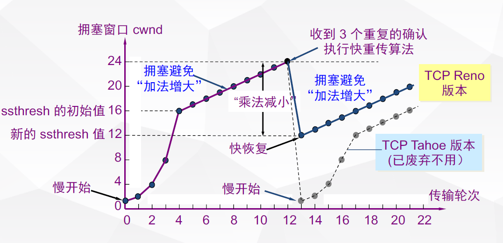

### 状态转移图

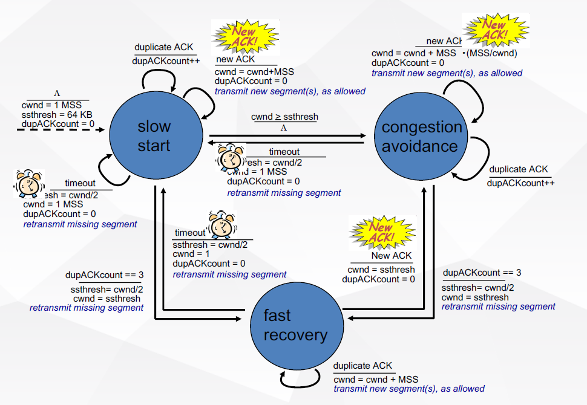

### 代码

#### 慢开始和拥塞避免

```java
if (ack >= send_base){
	......
	......
	if (cwnd >= ssthresh){
		pattern = CongestionController.CongestionAvoidance;
		cwnd_tmp += 1.0/cwnd;
		cwnd = (short) cwnd_tmp;
	}
	else {
		cwnd += 1;
		cwnd_tmp += 1;
	}
```

#### 超时重传

```java
public class RenoTimerTask extends TimerTask {
    private TCP_Sender senderClient;
    private Queue<TCP_PACKET> packets;
    public RenoTimerTask(TCP_Sender sender, Queue<TCP_PACKET> pkts){
        super();
        senderClient = sender;
        packets = pkts;
    }
    @Override
    public void run() {
        System.out.println("Net Congestion Detected!");
        System.out.println("Windows size in sender: " + senderClient.getCwnd());
        senderClient.setPattern(CongestionController.SlowStart);
        senderClient.setResend(true);
        senderClient.setCwnd((short) 1);
        senderClient.setSsthresh((short) (senderClient.getCwnd() / 2));
        Iterator<TCP_PACKET> pkt = packets.iterator();
        TCP_PACKET t = pkt.next();
        senderClient.udt_send(t);
        senderClient.setSend_base(t.getTcpH().getTh_seq());
        senderClient.setNext_resend_seq();
        System.out.println("Start SlowStart while sending the pkt: " + t.getTcpH().getTh_seq());
    }
}
```

#### 3-ACK

```java
if (ack == this.ack_cache){
	ack_times += 1;
	if (ack_times == 4){
		TCP_PACKET pkt = record.get(ack_cache + 1);
		System.out.println("3-ack, resend pkt: " + pkt.getTcpH().getTh_seq());
		udt_send(pkt);

		System.out.println("Windows size in sender: " + this.cwnd);
		cwnd = (short) (cwnd / 2);
		cwnd_tmp = cwnd;
		ssthresh = (short) Math.max(ssthresh / 2, 2);
		System.out.println("CongestionAvoidance used!");
		System.out.println("Windows size become:" + cwnd);
		System.out.println("ssthresh size become:" + ssthresh);
		pattern = CongestionController.CongestionAvoidance;
	}
}
else {
	this.ack_cache = ack;
	ack_times = 1;
}
```

#### 接收方

相较于 Go-Back-N rdt_recv 函数发生变动

```java
@Override
public void rdt_recv(TCP_PACKET recvPack) {
	if(CheckSum.computeChkSum(recvPack) == recvPack.getTcpH().getTh_sum()) {
		int seq = recvPack.getTcpH().getTh_seq();
		System.out.println("Receive seq: " + seq);
		System.out.println("Expect seq: " + expect_seq);
		if (seq < expect_seq){
			System.out.println("Duplicate pkt:" + recvPack.getTcpH().getTh_seq());
			System.out.println("Expected pkt:" + recvPack.getTcpH().getTh_seq());
			tcpH.setTh_ack(expect_seq-1);
			ackPack = new TCP_PACKET(tcpH, tcpS, recvPack.getSourceAddr());
			tcpH.setTh_sum(CheckSum.computeChkSum(ackPack));
			reply(ackPack);
			return;
		}
		recvBuffer.put(seq, recvPack.getTcpS().getData());
		int index = 0;
		for (int s: seq_buffer) {
			if (s > seq){
				break;
			}
			else {
				index += 1;
			}
		}
		seq_buffer.add(index, seq);
		int next_seq = expect_seq;
		System.out.println("====Receiver:New seq compute start====");
		System.out.println("seq in cached: ");
		for (int p: seq_buffer) {
			System.out.println(p);
		}
		while (seq_buffer.size() != 0 && seq_buffer.getFirst() == next_seq){
			next_seq += 1;
			seq_buffer.poll();
		}
		System.out.println("compute newest seq: " + next_seq);
		System.out.println("seq in cached left: ");
		for (int p: seq_buffer) {
			System.out.println(p);
		}
		System.out.println("====Receiver:New seq compute end====");
		for (int i = expect_seq; i < next_seq; i++) {
			dataQueue.add(recvBuffer.get(i));
			System.out.println("Deliver Data Seq:" + i);
		}
		deliver_data();
		expect_seq = next_seq;
		tcpH.setTh_ack(expect_seq-1);
		ackPack = new TCP_PACKET(tcpH, tcpS, recvPack.getSourceAddr());
		tcpH.setTh_sum(CheckSum.computeChkSum(ackPack));
		reply(ackPack);
	}else{
		System.out.println("An Error pkt: " + recvPack.getTcpH().getTh_seq());
		System.out.println("Recieve Computed: "+CheckSum.computeChkSum(recvPack));
		System.out.println("Recieved Packet"+recvPack.getTcpH().getTh_sum());
	}
	System.out.println();
}


```
#### 发送方

```java
/***************************4.x: 拥塞控制Reno版本;
**************************** Ctwo; 2020-12-21*/

package com.ouc.tcp.test;

import com.ouc.tcp.client.TCP_Sender_ADT;
import com.ouc.tcp.client.UDT_Timer;
import com.ouc.tcp.message.*;

import java.util.*;
import java.util.concurrent.LinkedBlockingQueue;

enum FlagType {
	Stable,            //信道无差错
	ErrorOnly,         //只出错
	LossOnly,          //只丢包
	DelayOnly,         //只延迟
	ErrorWithLoss,     //出错 / 丢包
	ErrorWithDelay,    //出错 / 延迟
	LossWithDelay,     //丢包 / 延迟
	RealEnv,           //实际环境=出错 / 丢包 / 延迟
}

enum CongestionController {
	SlowStart,           // 慢开始
	CongestionAvoidance, // 拥塞避免
	FastRetransmit,      // 快重传
	FastRecovery,        // 快恢复
}

public class TCP_Sender extends TCP_Sender_ADT {
	
	private TCP_PACKET tcpPack;	 // 待发送的TCP数据报
	private TCP_PACKET rcvPack;  // 已经收到的recv_pkt
	private UDT_Timer timer;
	private int RTT = 1000;
	private Queue<TCP_PACKET> packets_buffer;
	private HashMap<Integer, TCP_PACKET>record;
	private short cwnd = 1;
	private float cwnd_tmp = 1;
	private short ssthresh = 16;
	private int send_base = 1;
	private int next_seq = 1;
	private int next_resend_seq = 1;
	private RenoTimerTask task;
	private volatile CongestionController pattern = CongestionController.SlowStart;
	private int ack_cache = 0;
	private int ack_times;
	private boolean resend = false;
	public TCP_Sender() {
		super();
		super.initTCP_Sender(this);
		timer = new UDT_Timer();
		packets_buffer = new LinkedBlockingQueue<TCP_PACKET>();
		tcpH.setTh_eflag((byte) FlagType.RealEnv.ordinal());
		record = new HashMap<Integer, TCP_PACKET>();
	}
	@Override
	public void rdt_send(int dataIndex, int[] appData) {
		while (next_seq >= send_base + cwnd || resend){
		}
		// 下面的代码未发送变化
		...... 
	}
	@Override
	public void udt_send(TCP_PACKET stcpPack) {
        // 下面的代码未发送变化
		...... 
	}
	@Override
	public void waitACK() {
		int ack = this.rcvPack.getTcpH().getTh_ack();
		System.out.println("send_base: " + this.send_base);
		if (ack == this.ack_cache){
			ack_times += 1;
			if (ack_times == 4){
				TCP_PACKET pkt = record.get(ack_cache + 1);
				System.out.println("3-ack, resend pkt: " + pkt.getTcpH().getTh_seq());
				udt_send(pkt);
				System.out.println("Windows size in sender: " + this.cwnd);
				cwnd = (short) (cwnd / 2);
				cwnd_tmp = cwnd;
				ssthresh = (short) Math.max(ssthresh / 2, 2);
				System.out.println("CongestionAvoidance used!");
				System.out.println("Windows size become:" + cwnd);
				System.out.println("ssthresh size become:" + ssthresh);
				pattern = CongestionController.CongestionAvoidance;
			}
		}
		else {
			this.ack_cache = ack;
			ack_times = 1;
		}
		if (ack >= send_base){
			int d = (ack + 1) - send_base;
			send_base = ack + 1;
			this.slide(d);
			System.out.println("Clear: "+ ack);
			ackQueue.add(rcvPack.getTcpH().getTh_ack());
			if (send_base == next_seq){
				task.cancel();
			}
			else {
				task.cancel();
				task = new RenoTimerTask(this, packets_buffer);
				timer.schedule(this.task, 3000, 3000);
			}
			if (cwnd >= ssthresh){
				pattern = CongestionController.CongestionAvoidance;
				cwnd_tmp += 1.0/cwnd;
				cwnd = (short) cwnd_tmp;
			}
			else {
				cwnd += 1;
				cwnd_tmp += 1;
			}
			System.out.println("Windows size="+ cwnd);
			System.out.println("ssthresh size=" + ssthresh);
		}
		else{
			System.out.println("An outdated ack");
		}
		if (resend){
			System.out.println("===Sender:Resend start with seq: " + next_resend_seq);
			System.out.println("packets buffed:");
			for (TCP_PACKET pkt: packets_buffer) {
				System.out.println(pkt.getTcpH().getTh_seq());
			}
			if (send_base > next_resend_seq){
				next_resend_seq = send_base;
				System.out.println("Fast send_base move!!");
			}
			else {
				while (next_resend_seq < send_base + cwnd){
					for (TCP_PACKET pkt: packets_buffer) {
						if (pkt.getTcpH().getTh_seq() == next_resend_seq){
							udt_send(pkt);
						}
					}
					next_resend_seq += 1;
				}
				System.out.println("Early send pkt may lost in routing");
			}
			System.out.println("====Sender:Resend end in seq: " + next_resend_seq);
			if (next_resend_seq == next_seq){
				resend = false;
			}
		}
	}
	@Override
	public void recv(TCP_PACKET recvPack) {
		// 下面的代码未发送变化
		...... 
	}
	private boolean append(TCP_PACKET pkt) throws CloneNotSupportedException {
		// 下面的代码未发送变化
		...... 
	}
	private void slide(int s){
		// 下面的代码未发送变化
		...... 
	}
	public void setPattern(CongestionController pattern) {
		this.pattern = pattern;
	}
	public void setCwnd(short cwnd) {
		this.cwnd = cwnd;
		this.cwnd_tmp = cwnd;
	}
	public short getCwnd() {
		return cwnd;
	}
	public void setSsthresh(short ssthresh) {
		this.ssthresh = (short) Math.max(ssthresh, 2);
	}
	public void setResend(boolean resend) {
		this.resend = resend;
	}
	public void setNext_resend_seq() {
		this.next_resend_seq = this.send_base + 1;
	}
	public int getSend_base() {
		return send_base;
	}
	public void setSend_base(int send_base) {
		this.send_base = send_base;
	}
}

```

### 实验结果

全部的发送包的数据被记录在 Log.txt 下，应用层接收到的 data 被记录在 recvData.txt 中。

同时在控制台我输出了拥塞窗口大小和 ssthresh 的变化。

我们的分析会从上面的 3 个地方寻找并进行。

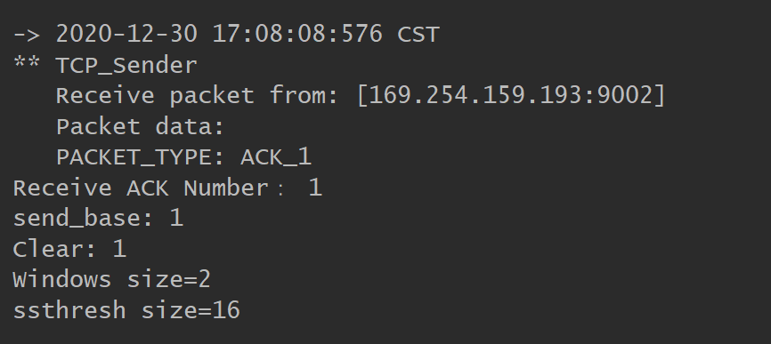

收到第一个包的时候，窗口大小为 2

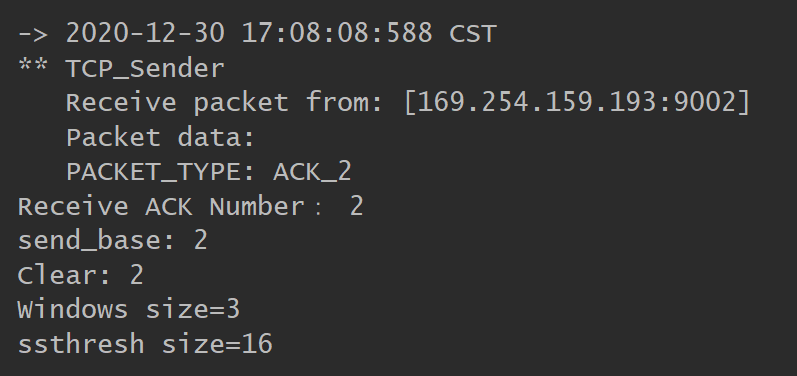

收到第 2 个 ACK 包的时候，此时 cwnd < ssthresh，仍加 1

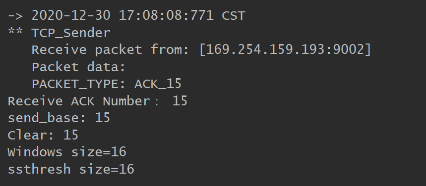

当收到第 15 个 ACK 包时，cwnd = ssthresh 进入拥塞避免

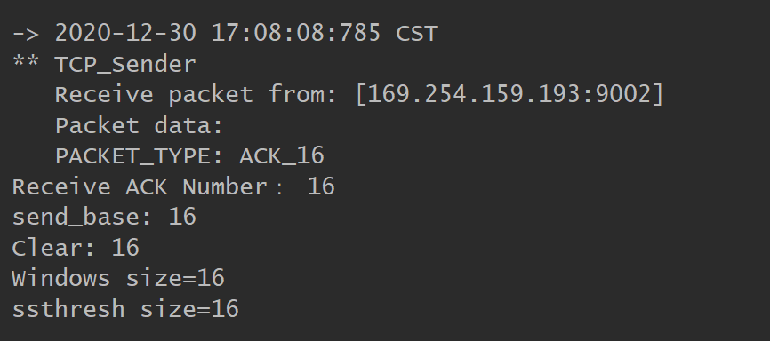

由于拥塞避免，收到第 16 个 ACK 不加 1

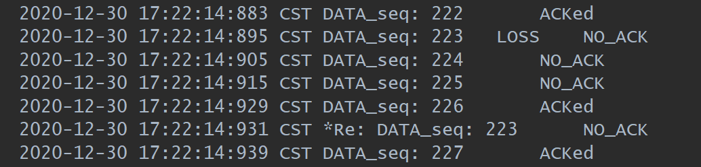

在第 223 号包发生丢包，随后发出去了224，225，226均未收到 ACK，但在收方缓存了下来。

我们看收方的记录，发送了 222 号包的确认了 4 次，包含3次重复的确认。

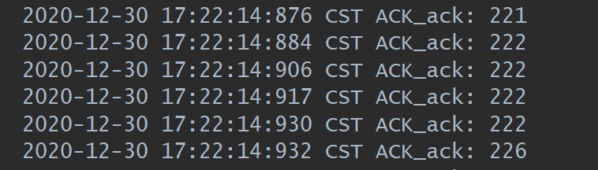

代码检测到了这3个重复的包，遵循快恢复的方法减半 ssthresh 和 cwnd，并执行拥塞避免算法。

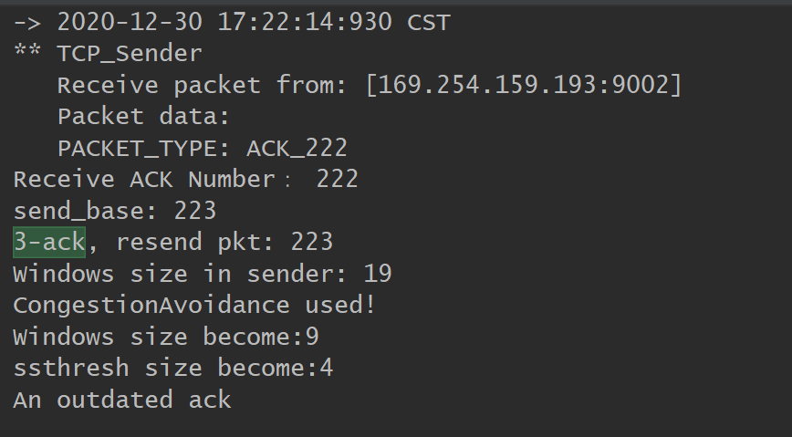

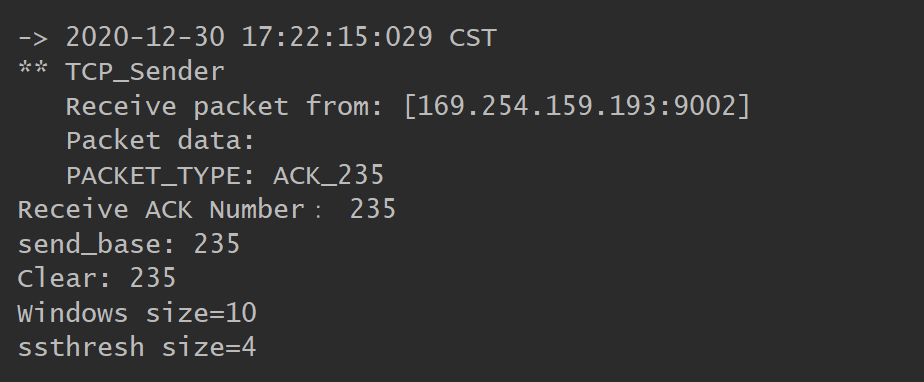

在收到第 235 个包，刚好是前一轮发出去的包（9个）的确认后，窗口加 1。


在发送 403 号包的时候发生了延时，后续的 404-407 号包发出去后发方收到了 4 个对 402 包的确认，重传了 403 号包，紧接着发出去了408 号包但由于 405 号包传输出错，接收方给了 404 号的 ACK，紧跟着发出去的 408 号包也收到了 404 号的 ACK。

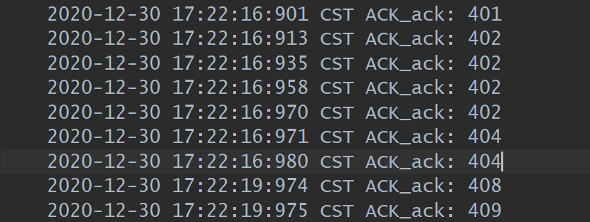

3s后发生超时重发

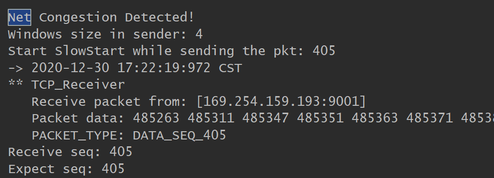

后续的如下图此时窗口大小变成了1，ssthresh 减半变成了 2。当收到了一个 ACK 后窗口大小加 1 变成了2。

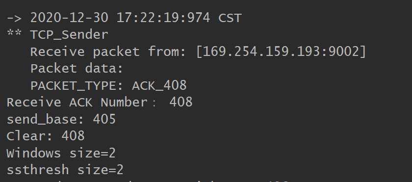

上面的一系列说明了我们成功实现了 Reno 版本的拥塞控制。

## 心得

### 迭代开发

虽然没有写在实验报告里面，但是还是完成了迭代开发的每一个版本，我觉得采用迭代开发的优点在于能更加清晰的理解整个过程，从最原始的开始，一步一步复杂化问题，不至于一开始无从下手。迭代开发也让我逐渐熟悉了整个开发的环境和平台。

### 解决的问题

- 最开始的时候使用计时器 `timer.cancel()` 会将任务一并杀掉，这时 `timer` 就无法再设置任务了。解决方法是只操作任务，取消，添加等等。
- 在实现 Go-Back-N 的时候发送的包全部为一个，原因在于 Java 类传值是仅仅传指针的，解决方法就是调用 `clone()` 函数新建一个，这样就避免了引用的问题。

## 建议

- 发包过程中的错误设置的有些不太全面，当实现到拥塞控制的时候，大部分情况下不会触发超时重传，因为丢包往往就丢一个，但实际的网络一旦发生了拥塞，就很有可能丢弃这一轮发送的全部的包。目前实验缺乏这个方面的测试，更多时候往往需要手动关闭 3-ACK 来测试超时重发。
- 应用层发包发的太快了，可以稍微慢一点，这样更方便观察。